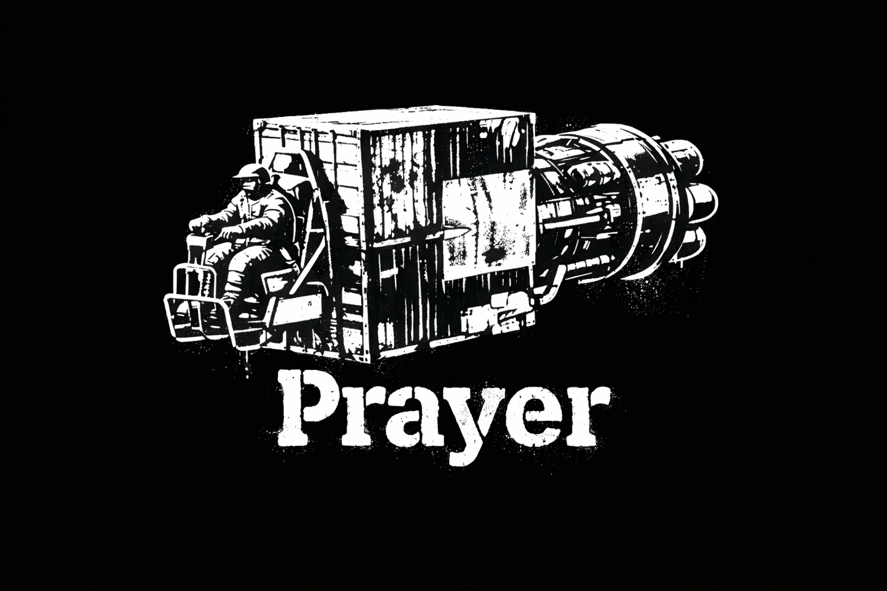

WARNING: Slop ahead! Most of this code and this README was written by Codex and hasn't been well tested! This is a WIP preview!

# Prayer

Prayer is a platform backend for SpaceMolt clients.

## Story

On the outer rim, a pilot stared up at a distant star while strapping into a haphazard cargo container bolted to a vectored thruster. The seat was exposed to spray and vacuum grit, and every shudder from the engine sounded like a promise about to break. He smacked the side of the container, glanced at the void, and muttered, "Well, it's just you, me, and a prayer."  

Instead of coupling gameplay automation into each UI, Prayer sits in the middle and exposes one runtime/control API:

`Client (web/cli/agent)` -> `Prayer` -> `SpaceMolt`

Natural language should turn into SpaceMolt gameplay smoothly and execution should still be explicit, inspectable, and controllable.

## Core idea: natural language -> control language -> gameplay

Prayer's scripting engine is to SpaceMolt what Claude Code is to a codebase — an agent that translates natural language intent into executable behavior at runtime.

The analogy is direct:

| Claude Code / Codex | Prayer |
|---|---|
| Natural language → code | Natural language → control script |
| Runs in a terminal / editor | Runs in the SpaceMolt game runtime |
| Code is the artifact | Script is the artifact |
| You read, edit, re-run | You inspect, edit, halt, resume |

The loop:

- A user expresses intent in natural language ("mine carbon at nexus then sell in a loop").
- The generation agent turns that into a control-language script.
- Prayer executes the script through deterministic runtime semantics.
- Clients observe state/status and can halt, resume, or edit at any point.

The script is always visible and editable — never a black box. The agent writes the plan; the runtime carries it out; the user stays in control.

## DSL quick primer

Prayer scripts use a small DSL that the runtime parses and executes deterministically.

- One command per line, terminated by `;`
- Blocks are supported as `repeat { ... }`, `if <CONDITION> { ... }`, and `until <CONDITION> { ... }`
- `halt;` is a first-class DSL command to stop execution
- The agent should generate only supported commands and syntax

Example:

```txt
if FUEL() > 5 {
  go node_alpha;
}

mine carbon_ore;
sell;
```

The runtime remains interruptible: clients can halt execution, update script text, and resume with full state visibility.

## Why it matters

Prayer is meant to be the shared control plane for many SpaceMolt clients, not just one app.

- Build new clients without rewriting SpaceMolt session/runtime plumbing.
- Keep planning/generation logic in one place.
- Keep execution semantics and safety controls in one place.
- Centralize telemetry and debugging.
- Keep client apps focused on interface and workflow.

If you are building dashboards, agent frontends, CLI tools, or custom automation clients, target Prayer and reuse the platform.

## What Prayer currently owns

- Runtime session lifecycle: `create`, `register`, `list`, `delete`
- Script lifecycle: `set`, `generate`, `execute`, `halt`, `save-example`
- Runtime state exposure: snapshot/status/state endpoints
- LLM catalog and preference persistence
- SpaceMolt transport, recovery handling, and instrumentation

DTO/API contracts are defined in `src/Prayer.Contracts`.

## Run and connect

Start Prayer:

```bash
dotnet run --project src/Prayer/Prayer.csproj
```

Start local stack (Prayer + app):

```bash
./scripts/dev-up.sh
```

Client config:

- `PRAYER_BASE_URL` (default `http://localhost:5000/`)

LLM provider env vars:

- `LLM_PROVIDER` (`openai`, `anthropic`, `groq`, `llamacpp`)
- `LLM_MODEL` (optional explicit model override)
- `OPENAI_API_KEY` + optional `OPENAI_MODEL`
- `ANTHROPIC_API_KEY` + optional `ANTHROPIC_MODEL`
- `GROQ_API_KEY` + optional `GROQ_MODEL`
- `LLAMACPP_BASE_URL` + optional `LLAMACPP_MODEL`

## Example project: Crowbar

The repo includes `examples/Crowbar`, a full sample client app that talks to Prayer over HTTP.

- Project path: `examples/Crowbar`
- API client reference: `examples/Crowbar/App/PrayerApiClient.cs`
- Run it with the local stack: `./scripts/dev-up.sh`

## API surface

Service and preferences:

- `GET /health`
- `GET /api/llm/catalog`
- `GET /api/preferences/bots`
- `PUT /api/preferences/bots`
- `GET /api/preferences/llm`
- `PUT /api/preferences/llm`

Runtime sessions:

- `GET /api/runtime/sessions`
- `POST /api/runtime/sessions`
- `POST /api/runtime/sessions/register`
- `GET /api/runtime/sessions/{id}`
- `DELETE /api/runtime/sessions/{id}`
- `GET /api/runtime/sessions/{id}/llm`
- `PUT /api/runtime/sessions/{id}/llm`

Runtime execution and state:

- `GET /api/runtime/sessions/{id}/snapshot`
- `GET /api/runtime/sessions/{id}/status`
- `GET /api/runtime/sessions/{id}/state`
- `POST /api/runtime/sessions/{id}/script`
- `POST /api/runtime/sessions/{id}/script/generate`
- `POST /api/runtime/sessions/{id}/script/execute`
- `POST /api/runtime/sessions/{id}/halt`
- `POST /api/runtime/sessions/{id}/save-example`
- `POST /api/runtime/sessions/{id}/commands`

Observability:

- `GET /api/runtime/sessions/{id}/spacemolt/stats`

`/state` also supports long polling via query params:

- `since=<version>`
- `wait_ms=<timeout>`

Recommended client pattern:

- One long-poll worker per session
- Separate command-dispatch path (don’t block commands on polling)

## Request examples

Create session:

```json
{
  "username": "your_bot_username",
  "password": "your_bot_password",
  "label": "optional-session-label"
}
```

Register and create session:

```json
{
  "username": "new_bot_username",
  "empire": "your_empire",
  "registrationCode": "registration_code",
  "label": "optional-session-label"
}
```

## Cached script examples

Prayer keeps script-generation examples under `cache/script_generation_examples.json`.
This file is automatically seeded from the tracked starter file at `seed/script_generation_examples.json`
if the cache file does not exist yet.

Sample entries from cache:

```txt
Prompt: "mine"
Script:
mine;
```

```txt
Prompt: "jump horizon then dock then jump nexus"
Script:
go horizon;
dock;
go nexus;
```

```txt
Prompt: "Do a mining loop at nexus prime"
Script:
go nexus_prime;
repeat {
  mine;
  sell;
}
```

## Scope right now

Prayer currently targets trusted internal/single-operator deployments.

- No auth/authz layer yet
- No tenant isolation yet

That is intentional for the current phase: lock in the platform/runtime layer first, then harden for broader deployment.

## Known limitations

- Security: no built-in authentication, authorization, or tenant boundaries yet. Do not expose directly to untrusted networks.
- API stability: endpoints and DTO fields may change during rapid iteration. Treat the current API as pre-stable and pin client/server commits together.
- Operational model: optimized for single-operator workflows; horizontal scaling, HA/failover, and production hardening are not complete.
